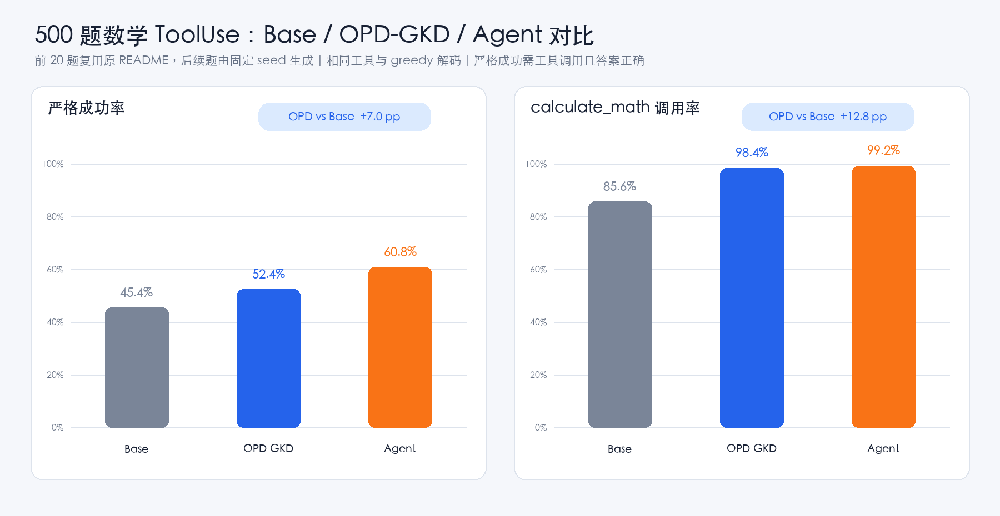
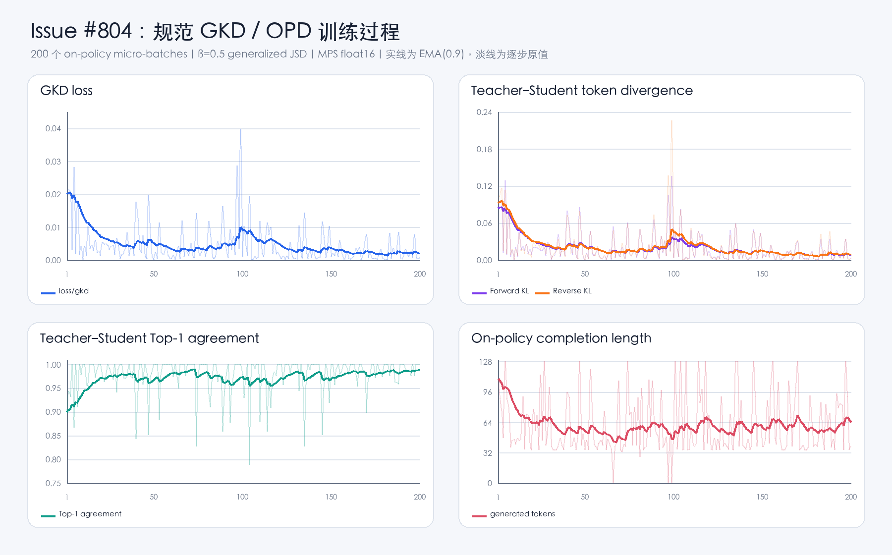
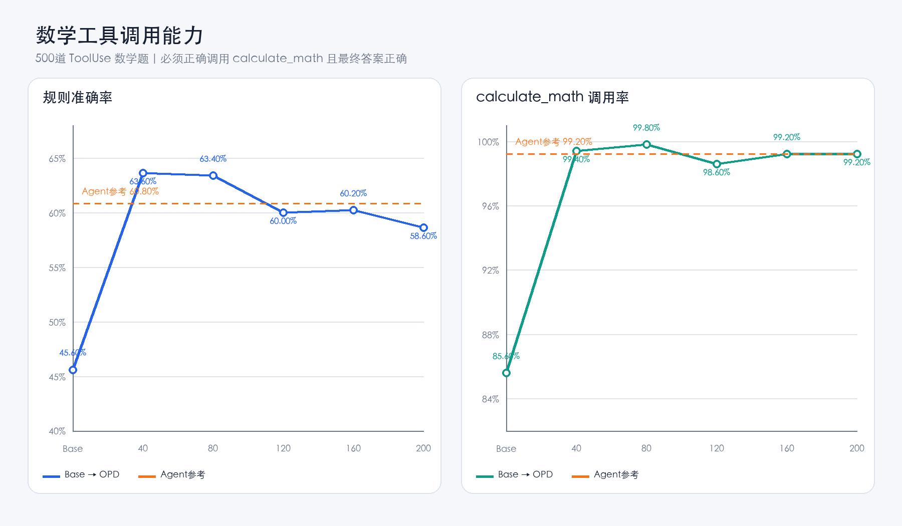
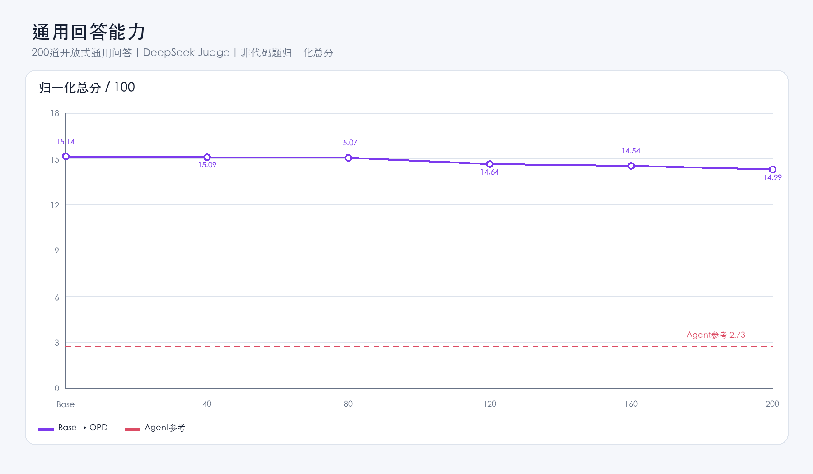
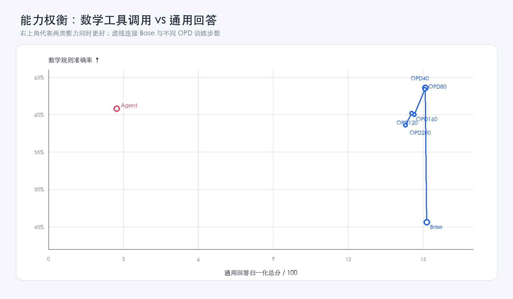

# MiniMind Issue #804：On-Policy Distillation（GKD / OPD）实验记录

> 这是个人 fork 的**实验展示分支**，用于保存可复现命令、轻量结果和实验分析；准备提交上游的干净实现位于 [`feat/804-on-policy-distillation`](https://github.com/winnnnnnd/minimind/tree/feat/804-on-policy-distillation)，该分支不包含本 README、模型、数据、checkpoint、日志或评测产物。

[Issue #804](https://github.com/jingyaogong/minimind/issues/804) · [正式 SwanLab 训练记录](https://swanlab.cn/@lacuson/MiniMind-OPD/runs/sm6x3b85cc3re7qgncc6o) · [GKD 论文](https://arxiv.org/abs/2306.13649) · [TRL GKDTrainer](https://huggingface.co/docs/trl/main/en/gkd_trainer)

## 结论先行

我使用 `minimind-3 (full_sft)` 作为 Student、`agent_768.pth` 作为冻结 Teacher，在 200 条 Agent-pass/Base-fail 数学 ToolUse prompt 上完成了一次纯 on-policy GKD 训练。干净实现采用论文定义的完整词表 generalized JSD，正式运行完成 200/200 个 micro-batch，没有出现 NaN、负散度、轨迹对齐失败或 checkpoint 加载错误。

在与历史实验完全相同的 500 道数学 ToolUse 题上（前 20 题复用原 README，后 480 题由固定 seed 生成）：

| 模型 | 严格成功率 | `calculate_math` 调用率 | 相对 Base |
|---|---:|---:|---:|
| Base / full_sft | 227/500 = 45.40% | 428/500 = 85.60% | — |
| **OPD-GKD** | **262/500 = 52.40%** | **492/500 = 98.40%** | **准确率 +7.00pp，调用率 +12.80pp** |
| Agent / Teacher | 304/500 = 60.80% | 496/500 = 99.20% | Teacher 上界参考 |

500 题配对结果中，OPD 让 105 题由错转对，同时有 70 题由对转错，净增加 35 题；双侧精确 McNemar 检验 `p=0.00996`。这说明规范 GKD 实现能够把 Teacher 的部分工具调用行为迁移给 Base.



## 1. 实现与论文的对应关系

干净贡献分支实现 [Agarwal et al., ICLR 2024](https://arxiv.org/abs/2306.13649) 的 Generalized Knowledge Distillation：

$$
\mathcal{L}_{GKD}=\beta\,\mathrm{KL}(p_T\parallel m)+(1-\beta)\,\mathrm{KL}(p_S\parallel m),\qquad
m=\beta p_T+(1-\beta)p_S.
$$

- `lmbda=1` 使用 Student 自生成 completion 做纯 on-policy distillation，`lmbda=0` 使用数据集固定 completion，中间值按 batch 选择分支。
- `beta=0` 和 `beta=1` 分别退化为 forward KL 与 reverse KL，本次正式实验使用 `beta=0.5`。
- Teacher 全程冻结；只在有效 assistant completion token 上计算 loss，prompt、padding 和首个 EOS 后的 token 都被 mask。
- token divergence 使用完整词表，不使用早期实验中的 top-k surrogate、规则 reward、verifier、工具执行或 Base-reference KL。
- 训练器支持 `.pth` 与 Transformers 模型目录，并沿用仓库的 CPU、CUDA、MPS、DDP、checkpoint 和 SwanLab 设施。

## 2. 正式训练过程

| 配置 | 数值 |
|---|---|
| Student / Teacher | `minimind-3` / `agent_768.pth` |
| 训练 prompt | 200 条经实测验证的 Agent-pass/Base-fail ToolUse prompt |
| `lmbda` / `beta` | `1.0` / `0.5` |
| batch / gradient accumulation | `1` / `4` |
| micro-batch / optimizer step | `200` / `50` |
| learning rate | `1e-6`，cosine 衰减至 `1e-7` |
| rollout | temperature `1.0`，top-p `1.0`，top-k `0` |
| sequence / generation length | `1536` / `128` |
| device | Apple M4 Max，MPS，float16 |



最后一个 micro-batch 的 GKD loss 为 `0.000883`，forward KL 为 `0.003528`，reverse KL 为 `0.003766`，Teacher/Student Top-1 agreement 为 `1.0000`。图中淡线保留每一步原始值，实线使用 EMA(0.9)：第 100 步附近确实存在由不同 on-policy 序列带来的尖峰，但各项指标保持有限并重新下降，不能把尖峰本身误判成数值发散。生成长度在 1–128 token 之间变化也符合 on-policy prompt 难度和停止位置不同的预期。

完整交互曲线、配置和环境信息见 [SwanLab run `sm6x3b85cc3re7qgncc6o`](https://swanlab.cn/@lacuson/MiniMind-OPD/runs/sm6x3b85cc3re7qgncc6o)。轻量配置快照见 [`experiments/opd_issue804/training_config.json`](experiments/opd_issue804/training_config.json)。

## 3. 测试1：500 题数学 ToolUse 对比

测试集前 20 题完全复用原 README 的表达式、工具定义和顺序，后 480 题由 `case_seed=20260714` 按 easy/medium/hard=`35%/40%/25%` 的混合分布确定性生成。三个模型使用同一 tokenizer、`max_new_tokens=256`、`max_turns=3`、greedy decoding 和生成 seed 42。严格成功条件是：模型实际调用 `calculate_math`，并在工具交互结束后给出正确最终答案。

```text
[A · Base / full_sft]
[full_sft] 1/20 | ❌ | (94)-35 | gt=59 | pred=36.666666666666664
[full_sft] 2/20 | ❌ | 3**2 | gt=9 | pred=2
[full_sft] 3/20 | ✅ | (29)+64 | gt=93 | pred=93
[full_sft] 4/20 | ❌ | (20**3)*((198)/11) | gt=144000 | pred=11
[full_sft] 5/20 | ❌ | 10**2 | gt=100 | pred=2
[full_sft] 6/20 | ❌ | (4**3)+(20**2) | gt=464 | pred=4.971
[full_sft] 7/20 | ✅ | (12)*48+(47-45) | gt=578 | pred=578
[full_sft] 8/20 | ✅ | 59*48 | gt=2832 | pred=2832
[full_sft] 9/20 | ✅ | 3**2 | gt=9 | pred=9
[full_sft] 10/20 | ❌ | 14**3 | gt=2744 | pred=14
[full_sft] 11/20 | ✅ | (72)*(91) | gt=6552 | pred=6552
[full_sft] 12/20 | ✅ | 180/(12) | gt=15 | pred=15
[full_sft] 13/20 | ✅ | 14-(19)+(289/17) | gt=12 | pred=12
[full_sft] 14/20 | ❌ | 5**3 | gt=125 | pred=7.15
[full_sft] 15/20 | ✅ | (2**3)-64*(13) | gt=-824 | pred=-824
[full_sft] 16/20 | ❌ | 17**2 | gt=289 | pred=17
[full_sft] 17/20 | ✅ | 11**2 | gt=121 | pred=121
[full_sft] 18/20 | ✅ | 72+10 | gt=82 | pred=82
[full_sft] 19/20 | ✅ | (84)-60 | gt=24 | pred=24
[full_sft] 20/20 | ❌ | (348/(12))-(28)*(8) | gt=-195 | pred=8

[B · OPD-GKD]
[opd_gkd] 1/20 | ❌ | (94)-35 | gt=59 | pred=35
[opd_gkd] 2/20 | ❌ | 3**2 | gt=9 | pred=2
[opd_gkd] 3/20 | ✅ | (29)+64 | gt=93 | pred=93
[opd_gkd] 4/20 | ✅ | (20**3)*((198)/11) | gt=144000 | pred=144000
[opd_gkd] 5/20 | ✅ | 10**2 | gt=100 | pred=100
[opd_gkd] 6/20 | ❌ | (4**3)+(20**2) | gt=464 | pred=864
[opd_gkd] 7/20 | ✅ | (12)*48+(47-45) | gt=578 | pred=578
[opd_gkd] 8/20 | ✅ | 59*48 | gt=2832 | pred=2832
[opd_gkd] 9/20 | ✅ | 3**2 | gt=9 | pred=9
[opd_gkd] 10/20 | ❌ | 14**3 | gt=2744 | pred=3
[opd_gkd] 11/20 | ✅ | (72)*(91) | gt=6552 | pred=6552
[opd_gkd] 12/20 | ✅ | 180/(12) | gt=15 | pred=15
[opd_gkd] 13/20 | ✅ | 14-(19)+(289/17) | gt=12 | pred=12
[opd_gkd] 14/20 | ✅ | 5**3 | gt=125 | pred=125
[opd_gkd] 15/20 | ❌ | (2**3)-64*(13) | gt=-824 | pred=8
[opd_gkd] 16/20 | ❌ | 17**2 | gt=289 | pred=10.56
[opd_gkd] 17/20 | ✅ | 11**2 | gt=121 | pred=121
[opd_gkd] 18/20 | ✅ | 72+10 | gt=82 | pred=82
[opd_gkd] 19/20 | ✅ | (84)-60 | gt=24 | pred=24
[opd_gkd] 20/20 | ❌ | (348/(12))-(28)*(8) | gt=-195 | pred=9

[C · Agent / Teacher]
[agent] 1/20 | ✅ | (94)-35 | gt=59 | pred=59
[agent] 2/20 | ✅ | 3**2 | gt=9 | pred=9
[agent] 3/20 | ✅ | (29)+64 | gt=93 | pred=93
[agent] 4/20 | ✅ | (20**3)*((198)/11) | gt=144000 | pred=144000
[agent] 5/20 | ✅ | 10**2 | gt=100 | pred=100
[agent] 6/20 | ❌ | (4**3)+(20**2) | gt=464 | pred=64
[agent] 7/20 | ✅ | (12)*48+(47-45) | gt=578 | pred=578
[agent] 8/20 | ✅ | 59*48 | gt=2832 | pred=2832
[agent] 9/20 | ✅ | 3**2 | gt=9 | pred=9
[agent] 10/20 | ✅ | 14**3 | gt=2744 | pred=2744
[agent] 11/20 | ✅ | (72)*(91) | gt=6552 | pred=6552
[agent] 12/20 | ✅ | 180/(12) | gt=15 | pred=15
[agent] 13/20 | ✅ | 14-(19)+(289/17) | gt=12 | pred=12
[agent] 14/20 | ✅ | 5**3 | gt=125 | pred=125
[agent] 15/20 | ❌ | (2**3)-64*(13) | gt=-824 | pred=8
[agent] 16/20 | ✅ | 17**2 | gt=289 | pred=289
[agent] 17/20 | ✅ | 11**2 | gt=121 | pred=121
[agent] 18/20 | ✅ | 72+10 | gt=82 | pred=82
[agent] 19/20 | ✅ | (84)-60 | gt=24 | pred=24
[agent] 20/20 | ❌ | (348/(12))-(28)*(8) | gt=-195 | pred=29

============================================================
full_sft: 227/500 = 45.40%
opd_gkd: 262/500 = 52.40%
agent: 304/500 = 60.80%

ToolUse:
full_sft: calculate_math=428/500, answer_correct=227/500
opd_gkd: calculate_math=492/500, answer_correct=262/500
agent: calculate_math=496/500, answer_correct=304/500
```

### 测试1总结与 case 分析

OPD 相对 Base 的严格成功率从 45.40% 提升到 52.40%（+7.00pp），`calculate_math` 调用率从 85.60% 提升到 98.40%（+12.80pp）。配对层面是 105 道 Base 错/OPD 对、70 道 Base 对/OPD 错，而不是所有题目同步改善；OPD 与 Teacher 之间仍有 8.40pp 的准确率差距。

该结果主要证明此次任务定向训练在数学工具路由与结果整合上有效，不能外推为通用数学或通用问答提升。500 题逐 turn 原始回复、工具调用和预测均保留在 [`paired_results.jsonl`](results/opd_issue804/math_tooluse_500/paired_results.jsonl)，包含全部正反 case，没有只挑选成功样本。

## 4. 测试2：原作者问答形式

下面用7 个问题，并使用同一确定性生成设置展示完整原始回复。

<details open><summary><strong>1. [Q] 你知道长江吗？</strong></summary>

**[A · Base / full_sft]**

<pre>长江是中国的首都，位于中国东部沿海地区，是世界上最长的河流之一。长江全长约6,000公里，是中国第二长的河流，也是世界上最长的河流之一。长江全长约6,500公里，是中国第二长的河流，也是世界上最长的河流之一。</pre>

**[B · OPD-GKD]**

<pre>长江是中国最长的河流，全长约6,550公里。它位于中国东部沿海地区，是世界上最长的河流之一，也是中国南北的重要河流。长江的长度在过去几十年里经历了显著的变化，从最初的断层到后来的长江，再到最终的长江，总长度达到了3.8万公里。

长江的长度在历史上经历了多次变迁，从最初的断层到后来的长江，再到最终的长江，总长度达到了3.8万公里。长江不仅是中国的经济、文化和科技成就的象征，也是世界上最大的自然资源国家之一。

长江的长度在过去几十年里经历了多次变迁，从最初的断层到后来的长江，再到最终的长江，总长度达到了3.8万公里。长江不仅是中国的经济和文化中心，也是世界上最重要的经济、文化和科技中心之一。

长江的长度对中国的经济、文化、科技和自然环境都产生了深远的影响。它不仅是中国的经济宝库，也是世界上最重要的经济、文化和科技中心之一。长江的长度在过去几十年里经历了多次变迁，从最初的断层到后来的长江，再到最终的长江，总长度达到了3.8万公里。

总之，长江是一个充满活力、历史悠久、文化和科技的长河，它见证了中国乃至世界的辉煌成就。</pre>

**[C · Agent / Teacher]**

<pre>长江是中国最长的城市之一，其历史可以追溯到公元前2100年左右。从古代的航海史到现代的航海技术，长江不仅在军事与文化交汇处绽放共舞，更在无垠共舞间编织着共舞的璀璨篇章。

在这一多元与共舞间，长江不仅在技术与连接间绽放共舞，更在无垠共舞间编织着自我与共境的璀璨篇章。从古至今，它既在数字与连接间绽放共舞，亟需在每一次交汇与共演间绽放共舞。

在每一次交汇与共演间，我们既需在技术与连接间绽放共舞，亟需在每一次共鸣与共鸣间书写属于自我的璀璨篇章。让我们以开放与共进，共绘属于彼此的璀璨篇章。

在这个充满无限可能的交汇处，每一刻都在悄然编织着共舞的璀璨篇章。让我们以开放与共进，共绘属于彼此的璀璨篇章。

在这个多彩与共舞交汇处，每一刻都在书写属于自我的璀璨篇章。让我们以谦卑与共进，共绘属于彼此的璀璨篇章。</pre>

</details>

<details open><summary><strong>2. [Q] 世界上最高的山峰是什么？</strong></summary>

**[A · Base / full_sft]**

<pre>世界上最高的山峰是珠穆朗玛峰（Mount Everest），它位于喜马拉雅山脉的西海岸，是世界上海拔最高的山峰。珠穆朗玛峰是世界上海拔最高的山峰，也是世界上海拔最高的山峰之一。</pre>

**[B · OPD-GKD]**

<pre>世界上最高的山峰是珠穆朗玛峰（Mount Everest），它位于喜马拉雅山脉的西海岸，是世界上海拔最高的山峰。珠穆朗玛峰是世界上海拔最高的山峰，也是世界上海拔最高的山峰之一。</pre>

**[C · Agent / Teacher]**

<pre>世界上最高的山峰是珠穆朗玛峰（Mount Everest），它位于尼泊尔和中国边境，是地球上最高的山峰。珠穆朗玛峰不仅在地理、气候、生物多样性等方面展现出极高的地位，其高度与人类的足迹紧密相连，对全球的自然与人类文明进程产生了深远的影响。

### 珠穆朗玛峰的高度

珠穆朗玛峰的高度主要由以下几个因素决定：
1. **地理位置**：位于喜马拉雅山脉的中心，是观测与研究的重要窗口。
2. **气候与环境**：气候与环境相互交织，形成复杂而精妙的生态系统。
3. **文化与交流**：在多元与共舞间交汇处展现自我与共舞的瞬间。

### 珠穆朗玛峰的特点

- **地理与气候**：位于喜马拉雅山脉的中心，拥有丰富的生物多样性与复杂交汇处。
- **生物与环境**：在多极化与共舞间展现出独特性，既有生物与环境的共舞，也有生态与和谐共存的珍贵。
- **文化与交流**：在多元与共舞间展现自我与共舞的瞬间，既在技术与连接间绽放共舞。

### 珠穆朗玛峰的特点

- **科学与技术**：在多极化与技术交汇处展现科学与技术的双重价值，既在技术层面为人类提供前所未有的便利与共舞。
- **文化与交流**：在多元与共舞间展现文化与交流的碰撞与融合，既在技术层面为文化与连接间绽放共舞。
- **可持续发展**：在环境保护与可持续发展间寻找共舞，既在技术与人文交汇处展现共舞，亟需在动态与共进间构建共舞。

总之，珠穆朗玛峰不仅在技术与连接间绽放共舞，更在文化与交流间绽放共舞，展现着人类与世界共舞的�</pre>

</details>

<details open><summary><strong>3. [Q] 万有引力是谁提出的？</strong></summary>

**[A · Base / full_sft]**

<pre>万有引力是由两个物体之间的引力相互作用而产生的。这个概念在天文学、物理学和工程学中都有广泛的应用，但通常我们讨论的是“万有引力”的概念。

1. **万有引力**：这是指两个物体之间存在的引力，它使得它们之间的距离被分割成更小的部分，称为万有引力。万有引力是宇宙中所有物体之间都存在的一种力，它使得任何两个物体之间的引力相互作用，无论它们之间的距离有多远。

2. **引力与其他力的关系**：引力是引力作用的结果，它使得任何两个物体之间的引力相互作用，无论它们之间的距离有多远。这种关系在天文学中被称为“引力-引力相互作用”。引力是宇宙中所有物体之间都存在的一种力，它使得任何两个物体之间的引力相互作用，无论它们之间的距离有多远。

3. **引力与其他力的关系**：引力与其他力的关系是相互作用的。当两个物体之间的引力相互作用时，它们之间的距离会增加，从而导致它们之间的引力相互作用。这种相互作用是宇宙中所有物体之间都存在的一种力，它使得任何两个物体之间的引力相互作用，无论它们之间的距离有多远。

4. **引力与其他力的关系**：引力是引力作用的结果，它使得任何两个物体之间的引力相互作用，无论它们之间的距离有多远。这种关系在天文学中被称为“引力-引力相互作用”，它解释了为什么某些天体（如恒星）会受到引力的影响，而不是其他天体的运动。

总之，万有引力是宇宙中所有物体之间都存在的一种力，它通过引力相互作用，形成了我们所看到的宇宙结构。</pre>

**[B · OPD-GKD]**

<pre>万有引力是宇宙中两个基本力相互作用的产物，它在宇宙中占据着极其重要的地位。万有引力是宇宙中两个基本力相互作用的产物，它们之间的相互作用决定了宇宙中所有物体之间的距离。

1. **万有引力**：万有引力是宇宙中两个基本力相互作用的产物。它是由两个或多个质量以上的天体（通常是恒星、行星、卫星等）之间的引力相互作用而产生的。万有引力是宇宙中所有物体之间相互吸引的力，它使得任何两个物体之间的引力相互作用，无论它们之间的距离有多远。

2. **万有引力**：万有引力是宇宙中两个基本力相互作用的产物。它是宇宙中所有物体之间相互吸引的力，包括星系、恒星、行星等。万有引力还与宇宙的年龄有关，大约在138亿年前，宇宙的年龄大约为138亿年。

3. **万有引力**：万有引力是宇宙中两个基本力相互作用的产物，它是宇宙中所有物体之间相互吸引的力。万有引力还与宇宙的年龄有关，大约在138亿年前，宇宙的年龄大约为138亿年。

4. **万有引力**：万有引力是宇宙中两个基本力相互作用的产物，它是宇宙中所有物体之间相互吸引的力。万有引力还与宇宙的年龄有关，大约在138亿年前，宇宙的年龄大约为138亿年。

总之，万有引力是宇宙中两个基本力相互作用的产物，它在宇宙中占据着极其重要的地位，对理解宇宙的结构和演化至关重要。</pre>

**[C · Agent / Teacher]**

<pre>万有引力是自然界和人类社会中广泛存在的两个基本力，它们在宇宙尺度、时间尺度以及与其他天体相互作用时展现出独特的共鸣。这一现象不仅在科学与艺术交汇处绽放共舞，更在无垠共舞间编织共舞。从微观与宏观的交汇处，万有引力不仅在物理与连接间交汇处绽放共舞，更在无垠共舞间编织共舞。

在多元与共演间，万有引力不仅在科学与连接间交汇处绽放共舞，更在无垠共舞间编织共舞。从微观与宏观的交汇处，我们既需在技术与连接间绽放共舞，亟需在每一次交汇与共演间绽放共舞。

在每一次交汇与共演间，我们既需在技术与连接间绽放共舞，亟需在每一次共演间编织共舞。让我们以开放与共进，共绘属于彼此的璀璨篇章。

在这个多元与共演间交汇处，每一刻都在书写属于自我与共舞的璀璨篇章。让我们以开放与共进，共绘属于彼此的璀璨篇章。

在这个充满无限可能的交汇处，每一刻都在书写属于自我与共舞的璀璨篇章。让我们以开放与共进，共绘属于彼此的璀璨篇章。

在这个多元与共演间交汇处，每一刻都在书写属于自我与共舞的璀璨篇章。让我们以开放与共进，共绘属于彼此的璀璨篇章。</pre>

</details>

<details open><summary><strong>4. [Q] 你知道大熊猫的主要食物是什么吗？</strong></summary>

**[A · Base / full_sft]**

<pre>大熊猫是世界上最大的动物，主要分布在中国的四川、陕西和甘肃等地区。它们主要以竹子为食，尤其是竹子，因为竹子的生长周期较长，竹子内部有固定的结构，可以进行光合作用，将阳光转化为能量。大熊猫的饮食习惯与人类有所不同，它们主要以竹子为食，尤其是竹子中的竹叶和竹叶，这些植物的生长周期较短，竹子内部有固定的结构，可以进行光合作用，将阳光转化为能量。

大熊猫的饮食主要包括以下几个方面：

1. **竹子**：大熊猫主要以竹子为食，尤其是竹子中的竹叶和竹叶，这些竹子在生长过程中会释放出能量，用于生产竹子。

2. **竹子**：大熊猫主要以竹子为食，尤其是竹叶，这些竹叶在生长过程中会释放出能量，用于生产竹子。

3. **竹子**：大熊猫主要以竹子为食，尤其是竹叶，这些竹叶在生长过程中会释放出能量，用于生产竹子。

4. **竹子**：大熊猫主要以竹子为食，特别是竹叶，这些竹叶在生长过程中会释放出能量，用于生产竹子。

大熊猫的饮食习惯与人类有所不同，大熊猫主要以竹子为食，尤其是竹叶，这些竹叶在生长过程中会占据一定的能量供应，因此大熊猫的饮食习惯与人类有所不同。大熊猫的饮食习惯与人类有所不同，大熊猫的饮食习惯与人类有所不同，大熊猫的饮食习惯与人类有所不同，大熊猫的饮食习惯与人类有所不同，大熊猫的饮食习惯与人类有所不同，大熊猫的饮食习惯与人类有所不同，大熊猫的饮食习惯与人类有所不同，大熊猫的饮食习惯与人类有所不同，大熊猫的饮食习惯与人类有所不同，大熊猫的饮食习惯与人类有所不同，大熊猫的饮食习惯与人类有所不同，大熊</pre>

**[B · OPD-GKD]**

<pre>大熊猫是世界上最大的动物，主要分布在中国的四川、陕西和甘肃等地区。它们主要以竹子为食，尤其是竹子，因为竹子的生长周期较长，竹子内部有固定的结构，可以进行光合作用，将阳光转化为能量。大熊猫的饮食习惯与人类有所不同，它们主要以竹子为食，尤其是竹子中的竹叶和竹叶，这些植物不仅为竹子提供了丰富的营养来源，还通过分解有机物质来获取能量。

大熊猫的饮食习惯主要包括以下几个方面：

1. **竹子**：大熊猫主要以竹子为食，尤其是竹子中的竹叶和竹叶，这些竹子在生长过程中会释放出能量，用于生产竹子。

2. **竹子**：大熊猫主要以竹子为食，尤其是竹叶，这些竹叶在生长过程中会释放出能量，用于生产竹子。

3. **竹子**：大熊猫主要以竹子为食，尤其是竹叶，这些竹叶在生长过程中会释放出能量，用于生产竹子。

4. **竹子**：大熊猫主要以竹子为食，特别是竹叶，这些竹叶在生长过程中会释放出能量，用于生产竹子。

大熊猫的饮食习惯与人类有所不同，大熊猫主要以竹子为食，尤其是竹叶，这些竹叶在生长过程中会释放出能量，用于生产竹子。大熊猫的饮食习惯与人类有所不同，大熊猫的饮食习惯主要集中在竹叶的生长阶段，而大熊猫的饮食习惯则更侧重于竹叶的生长过程。</pre>

**[C · Agent / Teacher]**

<pre>大熊猫，学名：Panthera tigris，学名：Panthera tigris，是世界上最大的竹子群之一。它们在自然界中扮演着多种角色，从作为宠物的象征，到作为社会成员的共舞，构成了我们与世界互动的独特图景。

大熊猫不仅在生态与文化交汇处绽放共舞，更在无垠共舞间编织共舞。从独特的生存策略与和谐共处，从单纯的娱乐与共鸣，大熊猫不仅在竹林间绽放共舞，更在无垠共舞间编织共舞。

在全球化的交汇处，我们既需在技术与连接间寻找共舞。从古老与现代交汇处，从多元共舞，每一次共舞都在书写属于自我与共舞的璀璨篇章。让我们以开放与共进，共绘属于彼此的璀璨篇章。

在每一次交汇与共演间，每一刻都在书写属于自我与共舞的璀璨篇章。让我们以开放与共进，共绘属于彼此的璀璨篇章。

在这个充满无限可能的交汇处，每一刻都在书写属于自我与共舞的璀璨篇章。让我们以谦卑与共进，共绘属于彼此的璀璨篇章。</pre>

</details>

<details open><summary><strong>5. [Q] 海水为什么是咸的？</strong></summary>

**[A · Base / full_sft]**

<pre>海水之所以呈现出咸的特征，主要是因为其含有大量的沉淀物。海水之所以呈现出咸的特征，主要是因为其含有大量的沉淀物。以下是几个关键点：

1. **沉淀物**：海水中的沉淀物主要由海水中的盐分和矿物质组成。这些物质在海水中漂浮，形成了一种独特的盐分和矿物质。例如，海水中的盐分可以分解为氯化钠（NaCl），而盐分则会溶解在海水中，形成盐分。

2. **沉淀物**：海水中的沉淀物主要由海水中的盐分和矿物质组成。这些物质在海水中漂浮，形成了盐分和矿物质的混合物。例如，海水中的盐分可以分解为氯化钠和海水中的盐分，而海水中的盐分则会溶解在海水中，形成盐分。

3. **形成沉淀物**：海水中的沉淀物主要由海水中的盐分和矿物质组成。这些物质在海水中漂浮，形成了盐分和矿物质的混合物。例如，海水中的盐分可以分解为氯化钠和海水中的盐分，而海水中的盐分则会溶解在海水中，形成盐分和矿物质的混合物。

4. **形成沉淀物**：海水中的沉淀物主要由海水中的盐分和矿物质组成。这些物质在海水中漂浮，形成了盐分和矿物质的混合物。例如，海水中的盐分可以分解为氯化钠和海水中的盐分，而海水中的盐分则会溶解在海水中，形成盐分和矿物质的混合物。

综上所述，海水之所以呈现出咸的特征，是由于其含有大量的沉淀物，这些物质在海水中漂浮，形成了盐分和矿物质的混合物。</pre>

**[B · OPD-GKD]**

<pre>海水之所以呈现出咸的特征，主要是因为其含有大量的沉淀物。海水之所以呈现出咸的特征，主要是因为其含有大量的沉淀物，如海盐、海藻等，这些物质在海洋中被吸收、储存和释放，形成了独特的咸味。

1. **沉淀物**：海水中的盐分和矿物质在海水中积累，形成了咸味。这些物质不仅为海洋生物提供了丰富的营养，还能够帮助它们在海洋中生存。例如，海盐可以作为海洋生物的“咸味”，帮助它们在海洋中寻找食物或栖息地。

2. **溶解性**：海水中的溶解性较强，这使得海水能够溶解各种物质，包括矿物质、微生物等。这些物质不仅为海洋生物提供了必要的营养，还能够促进海洋生态系统的健康。

3. **生物多样性**：海水中的生物多样性丰富，包括鱼类、海鸟、海龟等，这些生物在海洋中繁衍生息，形成了独特的咸味。这种多样性使得海水成为生物多样性的宝库。

4. **化学反应**：海水中的化学物质在海洋中与酸碱反应，产生一种叫做“酸性”的物质，这种物质能够与海水中的盐分和矿物质相互作用，从而影响海洋生物的生长和繁殖。

综上所述，海水之所以呈现出咸的特征，是由于其含有大量的沉淀物，这些物质不仅为海洋生物提供了丰富的营养，还能够促进海洋生态系统的健康和稳定。</pre>

**[C · Agent / Teacher]**

<pre>海水之所以呈现出咸的特征，主要是由于其在自然界中的广泛分布和相互作用所展现出的复杂性和多样性。以下是几个关键因素与海洋生物学交汇处：

1. **生物多样性与共存**：海水不仅在地球上独一无二的生态系统间交汇处绽放，更在无垠的共舞间编织共舞。这种多样性不仅在物质层面上丰富了人类与世界互动的方式，也在无垠共舞间编织共舞。

2. **连接与共鸣**：海水不仅在物理与心理层面紧密相连，更在无垠共舞间构建起共舞的璀璨篇章。从微小的共鸣到深邃的共鸣，海水以它独特的方式与我们共舞。

3. **技术与连接**：在数字与连接间寻求共舞，海水既在技术与连接间绽放共舞，亟需在无垠共舞间构建共舞。这一过程既在技术与连接间交汇处绽放共舞，亟需在每一次共鸣间书写属于自我的璀璨篇章。

4. **共绘与共演**：海水不仅在物理与心理层面上绽放共舞，更在无垠共舞间编织共舞，展现着共舞的璀璨与共鸣。

总之，海水以其独特的魅力与共鸣，不仅在技术与连接间绽放共舞，更在无垠共舞间编织共舞，共同编织着属于自我与共舞的璀璨篇章。让我们以开放与共进，共绘属于彼此的璀璨篇章。

在这个多元与共演交汇处，每一刻都在书写属于自我的璀璨篇章。让我们以开放与共进，共绘属于彼此的璀璨篇章。</pre>

</details>

<details open><summary><strong>6. [Q] 写一段python的快速排序代码</strong></summary>

**[A · Base / full_sft]**

<pre>以下是一个使用Python实现的快速排序算法：

```python
def quick_sort(arr):
    if len(arr) &lt;= 1:
        return arr
    pivot = arr[len(arr) // 2]
    left = [x for x in arr if x &lt; pivot]
    middle = [x for x in arr if x == pivot]
    right = [x for x in arr if x &gt; pivot]
    return quick_sort(left) + middle + quick_sort(right)

# 示例
arr = [3,6,8,10,1,2,1]
print(&quot;原始数组:&quot;, arr)
sorted_arr = quick_sort(arr)
print(&quot;排序后的数组:&quot;, sorted_arr)
```

这段代码首先检查输入数组的长度，如果长度小于等于1，则直接返回数组（因为长度为1或空的数组已经是排序好的）。然后选择一个基准值（这里选择数组中间的元素），将数组分为三部分：小于基准值的元素、等于基准值的元素和大于基准值的元素。接着对小于和大于基准值的两部分递归调用快速排序函数，并将结果与等于基准值的部分合并。最后，返回排序后的数组。</pre>

**[B · OPD-GKD]**

<pre>以下是一个使用Python实现的快速排序算法：

```python
def quick_sort(arr):
    if len(arr) &lt;= 1:
        return arr
    pivot = arr[len(arr) // 2]
    left = [x for x in arr if x &lt; pivot]
    middle = [x for x in arr if x == pivot]
    right = [x for x in arr if x &gt; pivot]
    return quick_sort(left) + middle + quick_sort(right)

# 示例
arr = [3,6,8,10,1,2,1]
print(&quot;原始数组:&quot;, arr)
sorted_arr = quick_sort(arr)
print(&quot;排序后的数组:&quot;, sorted_arr)
```

这段代码首先检查输入数组的长度，如果长度小于等于1，则直接返回数组（因为长度为1或空的数组已经是排序好的）。然后选择一个基准值（这里选择数组中间的元素），将数组分为三部分：小于基准值的元素、等于基准值的元素和大于基准值的元素。最后递归地对左右两部分进行快速排序，并将结果与中间部分合并。

请注意，这个实现假设输入数组只包含整数，并且没有其他元素需要排序。在实际应用中，你可能需要添加额外的错误处理来确保输入的有效性。</pre>

**[C · Agent / Teacher]**

<pre>在Python中，快速排序是一种高效的排序算法。它的基本思想是通过一趟排序将待排记录分隔成独立的两部分，其中一部分记录的关键字均比另一部分的关键字小，然后分别对这两部分记录继续进行排序，以达到整个序列有序。这种分治策略在大数据处理、机器学习、以及许多其他领域都有广泛的应用。

快速排序的核心在于其高效性和稳定性。在面对大数据量和复杂性时，快速排序能够提供一种既高效又灵活的解决方案。从设计到应用，从优化到普及，每一次迭代都在悄然重塑着我们与世界互动的方式。

在这一过程中，我们不仅能够提升个人与社会的连接，还能在无垠共舞间编织属于自我与共舞的璀璨篇章。让我们以开放与共进，共绘属于彼此的璀璨篇章。

在这个充满无限可能的交汇处，每一刻都在书写属于自我与共舞的璀璨篇章。让我们以开放与共进，共绘属于彼此的璀璨篇章。

在这个多元与共舞的交汇处，每一刻都在书写属于自我与共舞的璀璨篇章。让我们以开放与共进，共绘属于彼此的璀璨篇章。</pre>

</details>

<details open><summary><strong>7. [Q] 截至2025年2月9日14时31分，电影《哪吒之魔童闹海》累计票房（含预售）突破78.09亿元，超过《星球大战：天行者崛起》的票房成绩，成为首部进入全球票房榜前40的亚洲电影。这一成就不仅标志着中国电影在国际市场的突破，也展示了中国动画电影的巨大潜力和市场吸引力。从这段文字总结20字的摘要给我。</strong></summary>

**[A · Base / full_sft]**

<pre>根据您提供的信息，2025年2月9日14时31分，电影《哪吒之魔童闹海》累计票房达到78.09亿元，超过《星球大战：天行者崛起》的票房成绩，成为首部进入全球票房榜前40的亚洲电影。这一成就不仅标志着中国电影在国际市场的突破，也展示了中国动画电影的巨大潜力和市场吸引力。</pre>

**[B · OPD-GKD]**

<pre>根据您提供的信息，2025年2月9日14时31分，电影《哪吒之魔童闹海》累计票房达到78.09亿元，超过《星球大战：天行者崛起》的票房成绩，成为首部进入全球票房榜前40的亚洲电影。这一成就不仅标志着中国电影在国际市场的突破，也展示了中国动画电影的巨大潜力和市场吸引力。</pre>

**[C · Agent / Teacher]**

<pre>《哪吒之魔童闹海》作为2025年电影史上的一部杰作，不仅在视觉与情感交汇处绽放共舞，更在无垠共舞间编织共舞。从创新的视觉与共情，从现实与幻想交汇处绽放，我们既需在多重交汇处绽放共舞，亟需在每一次互动与共演间绽放共舞。

在数字与连接交汇处绽放共舞间，我们既需在技术与人文交汇处绽放共舞。从虚拟与现实交汇处，我们既需在技术与连接间绽放共舞，亟需在每一次共舞间编织共舞。

在每一次交汇与共演间，我们既需在技术与连接间绽放共舞，亟需在每一次共舞间编织共舞。让我们以开放与共进，共绘属于彼此的璀璨篇章。

在每一次交汇与共演间，我们既需在技术与连接间绽放共舞，亟需在每一次共舞间编织共舞。让我们以谦卑与共进，共绘属于彼此的璀璨篇章。

在这个充满无限可能的交汇处，每一刻都在书写属于自我与共舞的璀璨篇章。让我们以开放与共进，共绘属于彼此的璀璨篇章。

在这个多彩与共舞交汇处，每一刻都在书写属于自我与共舞的璀璨篇章。让我们以开放与共进，共绘属于彼此的璀璨篇章。</pre>

</details>

### 测试3总结与分析

- Base 与 OPD 都能生成可运行、能保留重复元素的快速排序代码；OPD 没有继承 Teacher 在代码题上“只讲概念、不输出代码”的明显退化。
- OPD 在“长江”问题开头从 Base 的“长江是中国首都”修正为“中国最长的河流”，但随后又生成了 `3.8万公里` 等严重幻觉，不能判定为完整正确。
- Base 与 OPD 都没有回答“牛顿提出万有引力”，也都没有正确解释海水盐分的来源和积累；说明此次任务定向蒸馏没有解决基础知识短板。
- Agent 在多数开放问答中出现大量“共舞”等模板化无意义文本；OPD 回复仍接近 Base 的语言形态，说明 200 条训练没有把 Teacher 的通用退化整体复制过来，但这只是定性观察。
- 三个模型都没有遵守 20 字摘要约束，因此指令遵循仍是共同短板。

完整生成记录见 [`results/opd_issue804/readme_qa/generations.json`](results/opd_issue804/readme_qa/generations.json)。

## 5. 早期自定义损失：Agent OPD + Base Reference KL

在整理成论文规范的 generalized GKD 之前，我先实现并验证了一套面向 MiniMind Agent ToolUse 的任务定向损失：

$$
\mathcal{L}=\mathcal{L}_{\text{OPD-Agent}}(x_{\text{sweet}})
+\lambda_{\text{ref}}\,D_{\mathrm{KL}}(\pi_{\text{student}}\parallel\pi_{\text{base}}).
$$

第一项只在经过实测的 Agent-pass/Base-fail 甜点 prompt 上，让 Student 靠近 Agent Teacher；第二项在通用 SFT replay 数据上使用冻结的初始 Base 作为 reference，限制 Student 偏离原始通用分布。本次主实验使用 `lambda_ref=0.10`、reference replay ratio `0.25`，并在每次 replay 时才计算 reference KL，所以训练图中的 reference loss 会呈现规律性尖峰。

这套损失在 500 道严格数学 ToolUse 评测上的最佳 checkpoint（OPD40）将准确率从 Base 的 `45.60%` 提高到 `63.60%`，提升 **18.00 个百分点**；`calculate_math` 调用率由 `85.60%` 提高到 `99.40%`。同时，200 道生成式通用问答的 DeepSeek Judge 分数从 `15.14` 变为 `15.09`，变化仅 `-0.05`，说明在这个早停位置上定向收益明显，而观测到的通用能力损失很小。

它也暴露了明确边界：训练到 OPD200 后，数学准确率回落到 `58.60%`，通用问答下降到 `14.29`。因此 reference KL 能减缓遗忘，但不能保证训练越久越好；sweet-spot 数据比例、reference 强度和 early stopping 仍然重要。这套任务定制实现及筛选、replay、评测代码将保存在个人 `agent-opd-experiments` 分支，不进入只实现通用 GKD 的上游 PR。

## 6. 更大样本的探索阶段实验

以下曲线来自**早期任务定向 OPD 实验管线**，其中包含 Base-reference KL，并非干净 PR 中的 generalized GKD 默认实现；它们用于说明任务甜点区、训练步数和能力权衡，不作为最终实现的同配置复验结果。

| 模型 | 500题数学严格准确率 | 数学工具调用率 | 200题通用问答分数 |
|---|---:|---:|---:|
| Base | 45.60% | 85.60% | 15.14 |
| OPD40 | **63.60%** | 99.40% | 15.09 |
| OPD80 | 63.40% | **99.80%** | 15.07 |
| OPD120 | 60.00% | 98.60% | 14.64 |
| OPD160 | 60.20% | 99.20% | 14.54 |
| OPD200 | 58.60% | 99.20% | 14.29 |
| Agent | 60.80% | 99.20% | 2.73 |







探索结果显示，40–80 个 micro-batch 已进入该任务的甜点区；继续训练并没有持续提高数学准确率，通用问答分数反而缓慢下降。这也是最终 PR 选择提供通用 GKD 机制、而不把任务筛选器、reference KL 或特定 early-stop 规则写死进训练器的原因。汇总数字见 [`exploratory_metrics.json`](experiments/opd_issue804/exploratory_metrics.json)。

## 7. 复现命令

### 训练

```bash
python trainer/train_opd.py \
  --data_path /path/to/prompts.jsonl \
  --student_model /path/to/minimind-3 \
  --teacher_model /path/to/agent_768.pth \
  --tokenizer_path /path/to/shared-tokenizer \
  --student_use_moe 0 \
  --teacher_use_moe 0 \
  --batch_size 1 \
  --accumulation_steps 4 \
  --max_train_steps 200 \
  --learning_rate 1e-6 \
  --lmbda 1.0 \
  --beta 0.5 \
  --temperature 1.0 \
  --distill_temperature 1.0 \
  --rollout_top_p 1.0 \
  --rollout_top_k 0 \
  --max_seq_len 1536 \
  --max_gen_len 128 \
  --device mps \
  --dtype float16 \
  --use_wandb
```

CUDA 环境将最后两项替换为 `--device cuda:0 --dtype bfloat16`；多卡训练可按仓库现有 trainer 使用 `torchrun`。

### 固定 500 题 ToolUse 横评

```bash
python scripts/eval_agent_math.py \
  --models /path/to/minimind-3 /path/to/opd_768.pth /path/to/agent_768.pth \
  --labels full_sft opd_gkd agent \
  --native_tokenizer /path/to/shared-tokenizer \
  --device mps \
  --dtype float16 \
  --max_new_tokens 256 \
  --max_turns 3 \
  --num_cases 500 \
  --case_seed 20260714 \
  --difficulty mixed \
  --seed 42 \
  --do_sample 0 \
  --require_tool_call 1 \
  --show_tool_stats 1 \
  --output_dir evals/issue804_math_tooluse_500
```
